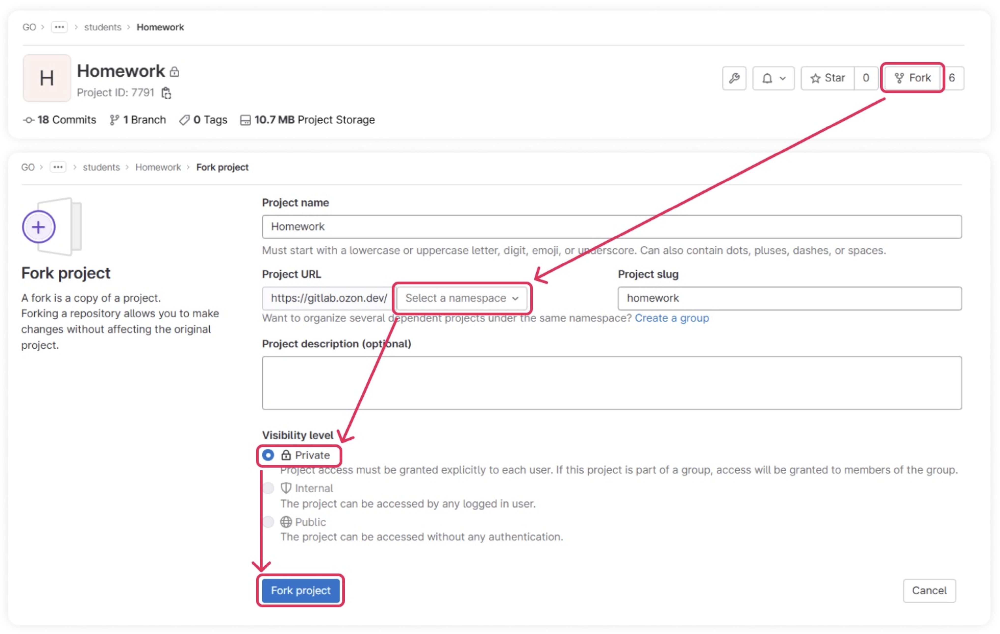
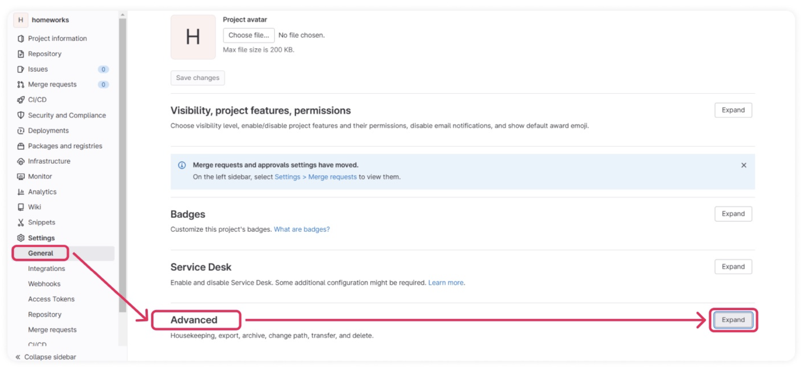
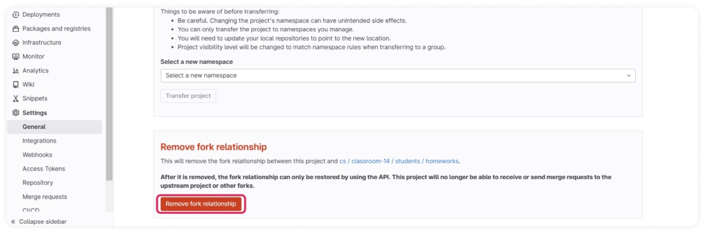
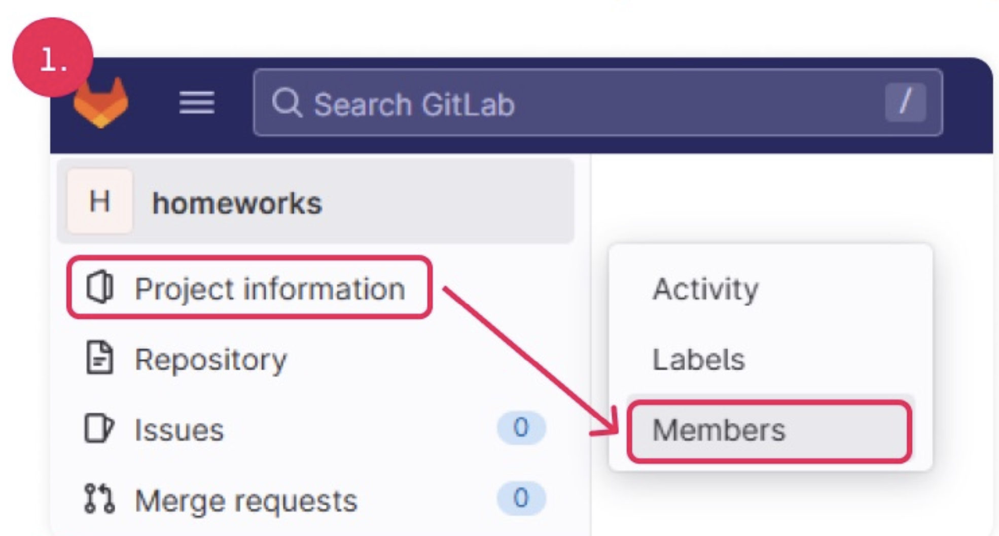
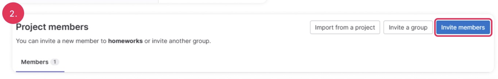
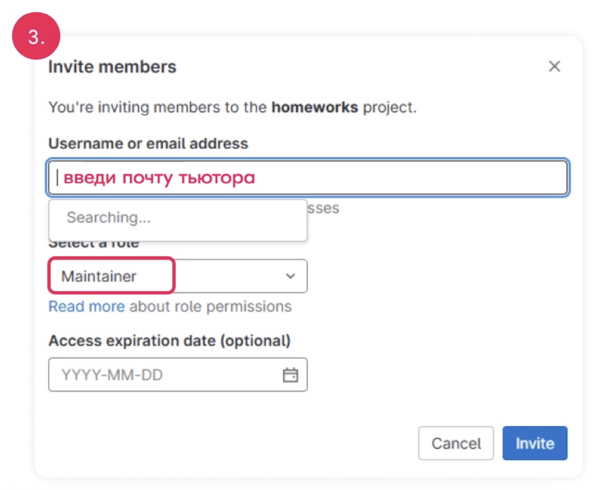

# Шаблон репозитория для реализации проекта на курсе Route 256

  Поздравляем с зачислением на курс "Продвинутая разработка микросервисов на Go"! Надеемся, что процесс обучения будет
увлекательным, а полученные знания пригодятся в работе!

  В рамках курса вам предстоит разработать проект – сервис для работы ПВЗ в миниатюре. Не нужно пугаться, ведь на этом пути вас
будет сопровождать команда преподавателей и тьюторов. Работа над проектом будет разбита из 8 модулей, каждому из
которых, посвящены две лекции и одно практическое занятие. Действующие инженеры Озона поделятся своим опытом и обратят
внимание на важные аспекты, которые неизбежно возникают при разработке высоконагруженных распределенных систем. По 
окончании каждого модуля будет предложено реализовать ту или иную часть из курсового проекта, имеющую непосредственное
отношение к теме модуля.
  
Желаем успехов в прохождении курса!

# Работа над курсовым проектом

## Инициализация проекта

Для работы над курсовым проектом необходимо выполнить инициализацию репозитория:

1. Открыть репозиторий https://gitlab.ozon.dev/go/classroom-19/students/homework (вы уже в нем);
2. Создать копию данного репозитория https://gitlab.ozon.dev/go/classroom-19/students/homework (форк проекта в свой 
  приватный репозиторий (см. рис. 1));
1. Разорвать связь с шаблонным репозиторием, для этого в GitLab необходимо выполнить: Settings › Advanced › Remove
  fork relationship (см. рис. 2 и 3);
1. Добавить тьютора в Members проекта. Для этого: Project information › Members › Invite member, пригласить своего
  тьютора с правами Maintainer (см. рис. 4, 5 и 6).

> ***Обрати внимание!  
> Если не разорвать связь с проектом, можно случайно отправить изменения в общий проект с шаблоном курсового проекта!***

Рис. 1. Создаем копию проекта

Рис. 2. Переходим в продвинутые настройки репозитория

Рис. 3. Разрываем связь в шаблонным проектом

Рис. 4. Настройки участников проекта

Рис. 5. Добавить новых участников

Рис. 6. Добавление тьютора с ролью Maintainer

## Выполнение домашнего задания:

1. В своём форке проекта необходимо создать ветку от master под выполняемое задание. Ветку **необходимо (MUST)** назвать
  GOJHW-N, где N– номер модуля, к которому относится выполняемое задание;
2. Выполнить задание;
3. Создать мерж-реквест ветки с решением в master в своём форке проекта;
4. Уведомить тьютора об отправке решения на проверку и поделиться ссылкой на мерж-реквест в Telegram;
5. После проверки задания тьютором он может оставить комментарии к решению. Если требующие исправления замечания
  отсутствуют, тьютор засчитывает решение, оставляя отметку (approve) на мерж-реквесте. По итогам проверки тьютор
  проставляет оценку за работу в таблице прогресса;
6. Необходимо устранить все обязательные замечания и добиться успешного прохождения проверки тьютором;
7. После того как решение зачтено тьютором, и работа над ним со стороны студента завершена, решение необходимо вмержить
  в ветку master.

## Формат названий на курсе Go на примере домашнего задания №1 (HW1):

| Формат наименования | Пример                          |
| ------------------- | ------------------------------- |
| Для ветки           | GOJHW-1                         |
| Для коммита         | [GOJHW-1] Свободный комментарий |
| Для мерж-реквеста   | [GOJHW-1] Свободный комментарий |
